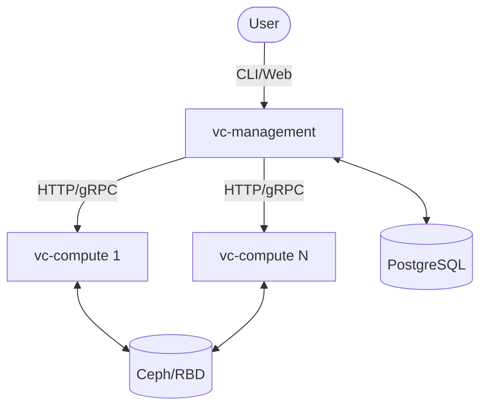

# VC Stack Component Documentation

This directory contains detailed documentation for the core components of VC Stack.

## Components

| Component | Description | Documentation |
| :--- | :--- | :--- |
| **vc-management** | The centralized management plane (control plane). | [Management Documentation](management.md) |
| **vc-compute** | The compute node agent (data plane). | [Compute Documentation](compute.md) |
| **vcctl** | The unified command-line interface. | [CLI Documentation](vcctl.md) |

## Component Relationships

For a high-level overview of the entire system, see the [Architecture Guide](../ARCHITECTURE.md).
